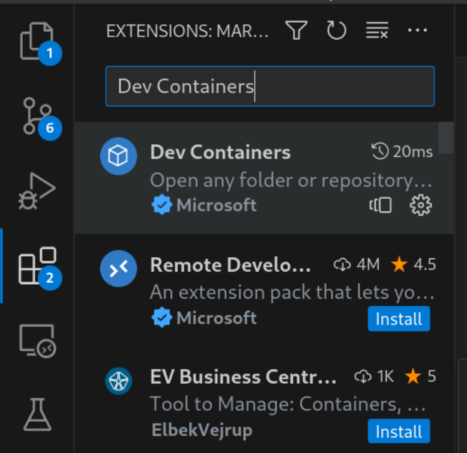
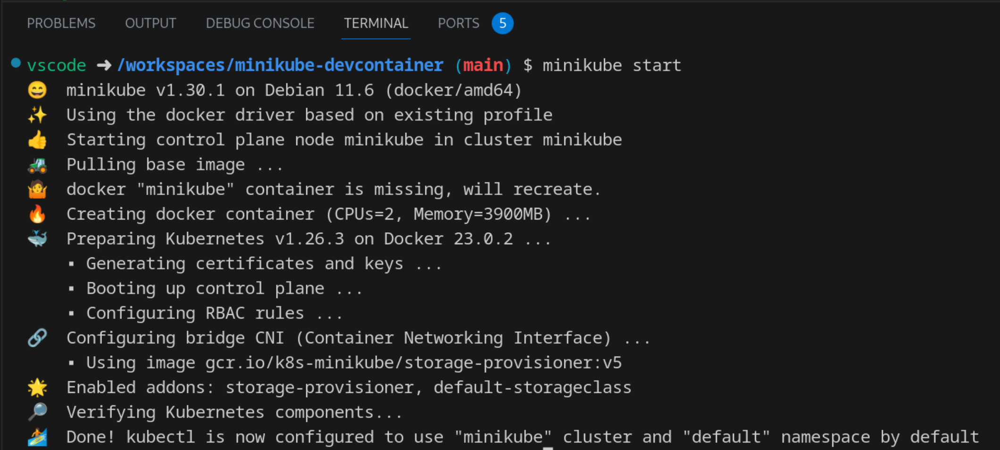
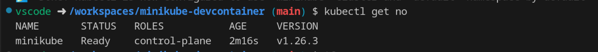

# minikube-devcontainer
Projeto com devcontainer com minikube

## Iniciando o Dev Container

Para utilizar o dev container, temos os seguintes requisitos:

- VSCode
- Plugin devcontainer do VSCode
- docker instalado na máquina

Para instalar o plugin, vá na aba de plugins e procure pelo plugin "Dev Containers" da microsoft.



Para iniciar o ambiente do container, clique no botão azul "><" no canto inferior esquerdo do VSCode.

Irá abrir um menu, escolha a opção "Reopen in container". 

Espere a operação terminar, a primeira execução pode demorar um pouco pois ele irá buildar os containers.

Para sair do container, aperte o botão azul do canto inferior esquerdo e escolha a opção "Reopen Folder Locally".

## Iniciando o minikube

No terminal do devcontainer digite:

```
minikube start
```



Teste se o minikube subiu:

```
kubectl get no
```

Se for encontrado um node minikube Ready, está tudo funcionando.



O local do kubeconfig é `/home/vscode/.kube/config`, caso precise.

Para visualizar o cluster pelo plugin do kubernetes, entre na aba dele e clique em refresh.