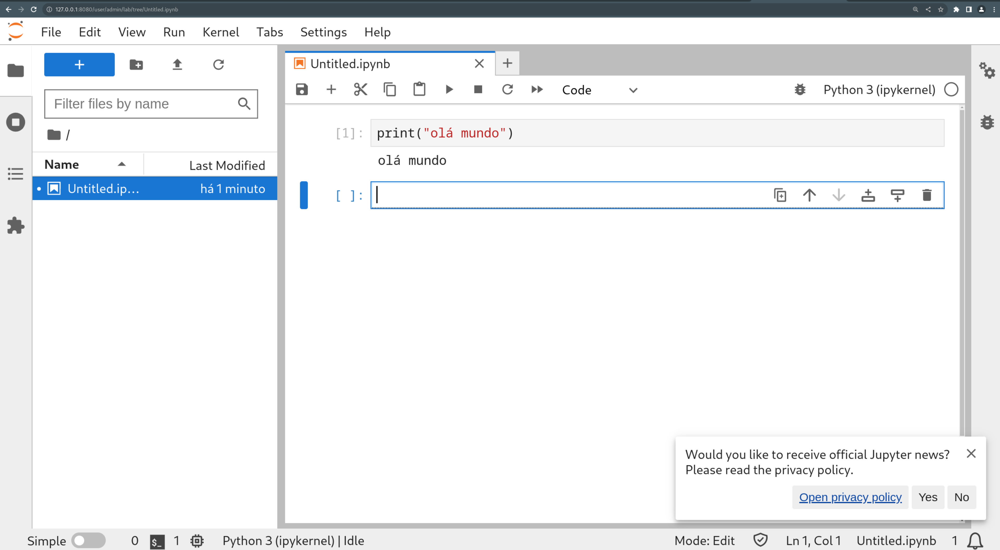

# Helm

Nesse tutorial, vamos fazer algumas instalações com o helm. 

Inicie o minikube seguindo o README da raiz do repositório.

Vamos começar checando que não existe nada instalado com helm com o comando:

```
helm helm ls -A
```

O resultado deve ser o seguinte:

```
NAME    NAMESPACE       REVISION        UPDATED STATUS  CHART   APP VERSION
```

Vamos checar se não existe nenhum repositório já adicionado:

```
helm repo list
```

O resultado deve ser o seguinte, pois não instalamos nenhum repositório.

```
Error: no repositories to show
```

Vamos instalar um [jupyter hub]() no nosso cluster de um nó só.

Primeiro precisamos adicionar o repositório:

```
helm repo add jupyterhub https://jupyterhub.github.io/helm-chart/
```

Agora devemos ter um repositório listado no helm com o comando `helm repo list`.

Vamos verificar os charts disponíveis no repositório jupyter.

```
helm search repo jupyter

NAME                    CHART VERSION   APP VERSION     DESCRIPTION                                       
jupyterhub/jupyterhub   2.0.0           3.0.0           Multi-user Jupyter installation                   
jupyterhub/pebble       1.0.1           v2.3.1          This Helm chart bootstraps Pebble: an ACME serv...
```

Vamos instalar o jupiterhub com o comando:


```
helm install my-jupyterhub jupyterhub/jupyterhub --version 3.0.0-beta.1
```

Vamos esperar um pouco para tudo estar pronto.

Como estamos em um ambiente local e não temos um ingress, então vamos utilizar um port-forward para ver o sistema.

```
kubectl --namespace=default port-forward service/proxy-public 8080:http
```

Abra o navegador e entre no http://localhost:8080

Você pode logar no sistema com:

```
usuario: admin
senha: admin
```

Parabéns, você tem o seu colab local.



Para verificar o jupyterhub instalado, vamos utilizar o `helm list`.

```
$ helm list
NAME            NAMESPACE       REVISION        UPDATED                                 STATUS          CHART                   APP VERSION
my-jupyterhub   default         1               2023-06-14 23:11:21.745310602 +0000 UTC deployed        jupyterhub-3.0.0-beta.1 4.0.1      
```

Para remover a release do cluster, vamos utilizar o `helm uninstall {nome da release}`

```
helm uninstall my-jupyterhub
```